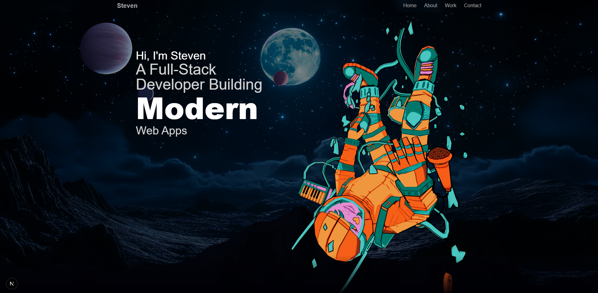

# 💼 Steven Echeverria – Developer Portfolio

This is my personal full-stack developer portfolio, built to showcase my projects, skills, and background as I pursue a software engineering career. It's designed with performance, aesthetics, and real-world functionality in mind.

---

## 🔧 Tech Stack

- **Frontend**: Next.js, React, TypeScript, Tailwind CSS
- **Backend**: Prisma ORM, PostgreSQL, Clerk Authentication
- **Deployment**: Vercel (coming soon)
- **Tools**: Git, GitHub, Visual Studio Code, Figma, Photoshop

---

## ✨ Features

- ⚡ Responsive design with custom animations
- 🌎 Animated globe component showing timezone
- 🛠️ Reusable card components with dynamic styling
- 💻 Auto-scrolling animated tech stack sections
- 📫 Copy-to-clipboard email button
- 🎨 Custom styling and subtle gradients

---

## 🖥️ Live Demo

🔗 Deployment coming soon on [Vercel](https://vercel.com)

---

## 📷 Preview



---

📄 License
MIT License
© 2025 Steven Echeverria

## 🚀 Run Locally

```bash
git clone https://github.com/yourusername/githubportfolio.git
cd githubportfolio
npm install
npm run dev
